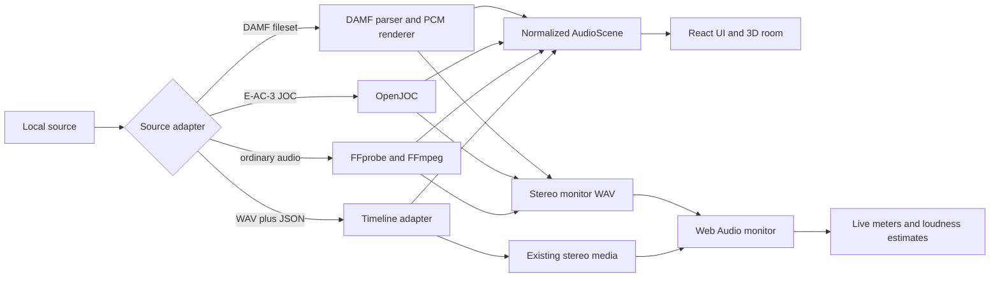

# Architecture

## Design objective

The application normalizes several very different media sources into one UI scene while preserving the truth about each source. A visual dot is not automatically an authored object, and a delivery bitstream is not treated as if it still contained a recoverable authoring session.

The central design rule is: capability comes from verified source data, not from the filename or the appearance of the visualization.

## System overview

## Frontend

The frontend is React and TypeScript under `src/`.

- `components/RendererApp.tsx` owns source selection, source capabilities, transport state, DAMF variant selection, and high-level layout.
- `adapters/nativeMedia.ts` is the typed Tauri bridge for probing, preparing, rendering, reading timelines, and exporting WAV files.
- `adapters/dolbyDemo.ts` parses the visualization-timeline schema and constructs capability-limited scenes for ordinary audio and delivery-bitstream proxies.
- `domain/scene.ts` defines the normalized `AudioScene`, object samples, interpolation, and the capability flags used to gate UI actions.
- `hooks/useAudioTransport.ts` owns the media element, Web Audio graph, monitor gain, limiter used for boosted DAMF previews, signal analysis, and transport clock.
- `components/RoomView.tsx` renders the interactive three.js room through React Three Fiber.

The Room View uses `frameloop="demand"`. It redraws when source samples or camera state change instead of continuously rendering an idle scene.

## Native backend

The Tauri backend is Rust under `src-tauri/src/`.

### Generic media path

`lib.rs` invokes system `ffprobe` to identify the first audio stream. Directly playable PCM WAV files can be returned unchanged; other ordinary formats are converted by system `ffmpeg` to a 48 kHz stereo float WAV in the application cache.

The backend executes external tools as child processes and reports bounded errors to the UI. FFmpeg binaries are not bundled by this repository.

### E-AC-3 JOC path

For a source positively identified as E-AC-3 with an Atmos/JOC profile, the backend invokes the bundled OpenJOC 0.7.0 executable. Playback requests a 2.0 speaker render. Export can request 2.0, 5.1, 7.1, or 7.1.4 and optionally uses FFmpeg to split the multichannel render into mono speaker feeds. It also runs OpenJOC's OAMD diagnostic command for a bounded element-count report.

If OpenJOC rendering fails, the backend may prepare the codec-core channel downmix through FFmpeg and marks that fallback explicitly. A cached fallback remains labelled as a fallback.

OpenJOC's semantic binding is unresolved. The normalized scene can therefore show diagnostic element proxies, but the capabilities `objectPositions`, `objectAudio`, `objectSolo`, `objectMute`, and `rerender` remain false for this source path.

For a positively identified JOC source, the Source Inspector also exposes two transactional delivery-data exports:

- FFmpeg stream-copies the E-AC-3 audio stream to `.eac3`/`.ec3` without decoding or re-encoding;
- OpenJOC scans all access units and writes forensic OAMD evidence to JSON.
- OpenJOC renders decoded speaker feeds; FFmpeg channel splitting does not recover authored object stems.

The forensic OAMD document is deliberately separate from the internal `AudioScene`/visualization JSON schema. Importing it as a timeline must fail closed: access-unit evidence is not sampled position/loudness scene data. OpenJOC diagnostic reconstruction rows are likewise outside the capability model while semantic binding remains unresolved.

Both commands write a partial file, validate successful nonempty output (and valid JSON for diagnostics), then promote it to the user-selected destination. These operations preserve delivery data; they do not reconstruct authoring data.

### DAMF path

`damf.rs` validates the `.atmos` manifest and the companion `.atmos.audio`, `.atmos.metadata`, and `.atmos.dbmd` files. It parses YAML metadata, validates CAF PCM packing, resolves object events, produces an authored timeline, and streams 24-bit interleaved PCM to a stereo float WAV preview.

The DAMF manifest binds object identifiers to PCM channels and metadata, so this adapter enables authored positions, levels, object audio, solo, mute, and re-render.

The preview renderer uses equal-power horizontal panning, authored gain/state events, a global gain, and a soft limiting function. It is intentionally independent and is not a licensed Dolby reference renderer.

Solo rendering still reads the interleaved CAF but decodes and mixes only the selected object channel. Mute rendering can subtract selected object contributions from the inverse-soft-limited cached full mix. Full, solo, and mute outputs are cached independently.

## Normalized scene and capability model

Every adapter produces an `AudioScene` with:

- source name and source label;
- duration, sample rate, and metadata frame interval;
- zero or more timeline objects with input IDs, positions, and levels;
- scene loudness metadata used by visual panels;
- a capability object describing which actions are trustworthy.

Capability flags are part of the product contract:

| Flag | Meaning |
| --- | --- |
| `objectPositions` | Positions are authored or otherwise trustworthy, not merely decorative proxies. |
| `objectLevels` | Per-object levels came from the source's meaningful metadata or analysis. |
| `objectAudio` | Independently addressable object PCM is available. |
| `objectSolo` | The backend can render the selected object alone. |
| `objectMute` | The backend can remove selected object contributions. |
| `rerender` | Position/audio binding is sufficient for a new monitor render. |

UI controls must remain disabled when the corresponding capability is false.

## Monitor and measurement path

The audible desktop output is a two-channel monitor preview. Web Audio applies global attenuation, DIM, MUTE, and optional DAMF make-up gain. DAMF full mixes receive +24 dB and object solos receive +36 dB before a high-ratio dynamics compressor used as an output safety stage.

The meter analysis reads the actual post-monitor stereo signal approximately every 100 ms. The timeline updates at roughly 30 frames per second. Reported LUFS-style values are lightweight signal-derived monitor estimates, not certified ITU-R BS.1770 measurements. The UI must not label them as compliance measurements.

## Cache model

Prepared media is stored below Tauri's application cache directory in `prepared-media/<source-key>/`. The source key includes path and file metadata so an unchanged source can reuse a completed result.

Important invariants:

- incomplete or header-only output is never accepted as a playable cache entry;
- the cache records whether an E-AC-3 result came from OpenJOC or FFmpeg fallback;
- DAMF full, solo, and mute variants use distinct filenames;
- exports copy a completed prepared WAV rather than exposing a partial work file.

## Trust and security boundaries

Media and metadata are untrusted input. The backend validates file existence, extensions where relevant, companion structure, YAML/JSON parsing, sizes, PCM format assumptions, and object identifiers before rendering. External process arguments are passed as arguments rather than composed into a shell command.

The Tauri asset protocol currently permits broad local asset scope for selected media. Future hardening should narrow this scope and add explicit size/depth limits before treating the application as safe for hostile files. See [Security](../SECURITY.md) and [Roadmap](ROADMAP.md).
